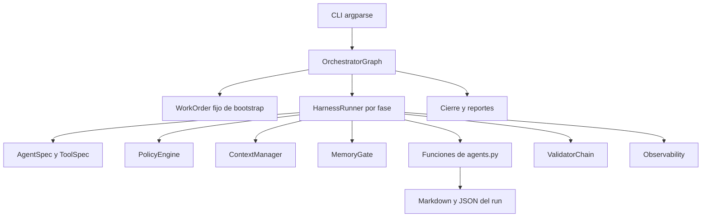

# CURRENT_ARCHITECTURE — Auditoría de NexoNova Factory

Fecha: 2026-09-06. Estado: análisis; no autoriza implementación ni migración.

## 1. Dictamen y alcance

El árbol entregado contiene un **prototipo local de orquestación documental en Python**, con contratos de entrada/estado, registros declarativos, controles parciales y trazas. Tiene componentes reutilizables, pero **no genera todavía plataformas web de clientes**. Los 13 agentes son funciones Python que escriben textos y JSON predeterminados. No existe un cliente de modelos, un motor de herramientas ejecutables, plantillas de aplicaciones, módulos web, infraestructura desplegable ni actualización de productos.

El principal problema no es la organización de carpetas: es la distancia entre capacidades declaradas y capacidades comprobadas. Hay reportes de cobertura, pruebas, seguridad y aprobación que se construyen con valores constantes. El núcleo debe evolucionar incrementalmente; no se justifica reescribirlo en otro lenguaje ni introducir un framework de agentes.

Se leyó primero `AGENTS.md`, se inspeccionaron los 14 módulos Python completos, las nueve pruebas, los registros, el documento ERP y los artefactos de la ejecución histórica. Se inventariaron 165 archivos, incluidos cachés y metadatos locales; 119 pertenecen a una única ejecución histórica. El núcleo suma 1.885 líneas físicas de Python y las pruebas 149. Se comprobaron sintaxis Python y formato JSON/JSONL. Las ubicaciones de evidencia indicadas son relativas al repositorio original y las líneas corresponden a esta copia.

**Restricción respetada:** ningún archivo del proyecto fue creado, editado, movido o borrado. Los tres documentos y diagnósticos se prepararon en `/tmp/nexonova-audit-2026-09-06/`. Las comprobaciones que escriben estado usaron exclusivamente una copia de `factory/` y `tests/` en ese directorio temporal. No se accedió a servicios externos ni se instalaron dependencias.

Limitaciones: `.git/` está vacío en el entorno visible y `git status` falla indicando que no es un repositorio Git. No se pueden auditar commits, ramas, remotos, historial de secretos ni archivos ausentes de esta copia. No hay evidencia suficiente para determinar si los documentos faltantes fueron eliminados, excluidos o quedaron en otro equipo. El análisis del stack objetivo usa los requisitos proporcionados; no certifica compatibilidad de versiones ni vulnerabilidades de paquetes no presentes.

## 2. Árbol relevante y propósito

```text
./
├── AGENTS.md                        instrucciones vigentes de NexoNova
├── factory/                         paquete Python ejecutable
│   ├── __init__.py                   identidad y versión del paquete
│   ├── cli.py                        entrada por argparse
│   ├── constants.py                  identidad, rutas, versiones y fases
│   ├── schemas.py                    contratos y validador parcial
│   ├── registry.py                   13 agentes, 27 tools, 15 skills
│   ├── orchestrator.py               ruta secuencial y cierre del run
│   ├── harness.py                    preparación y ejecución de funciones
│   ├── agents.py                     productores documentales estáticos
│   ├── policy.py                     reglas declarativas de permisos
│   ├── validators.py                 nueve nombres de validadores
│   ├── context.py                    recuperación léxica documental
│   ├── memory.py                     archivos de memoria y propuestas
│   ├── observability.py              logs y estimaciones de consumo
│   ├── utils.py                      JSON, hashes, rutas y tiempo
│   └── __pycache__/                  bytecode local
├── tests/
│   ├── test_factory.py               nueve pruebas pytest
│   └── __pycache__/                  bytecode local
├── project/                         mezcla de workspace, historial y brief
│   ├── README.md                    descripción mínima del primer proyecto
│   ├── Aprendizaje.md               nota de memoria/manual de consumo
│   ├── latest-run.json              ruta absoluta de otro equipo
│   ├── registry-summary.json        inventario exportado
│   ├── tool-availability.json       detección histórica de comandos
│   ├── cache/                       vacío
│   ├── index/                       vacío
│   ├── agent-memory/                vacío
│   ├── PROYECTO CINCO/
│   │   ├── especificacion_cinco.md   brief ERP de 1.869 líneas
│   │   └── .gitignore               exclusiones Node y macOS
│   └── runs/RUN-6ae1cda94717/
│       ├── work_order.json, state.json, final-report.json
│       ├── spec.md, clarifications.md, plan.md, tasks.md, contracts.md
│       ├── checklist.md, CHECKLIST_APLICADO.md, analyze-report.json
│       ├── context-pack.json, context-pack.md, evidence-register.json
│       ├── screen-analysis.json, ui-spec.md, openapi.yaml, api-security.md
│       ├── implementation-report.md, test-plan.md, test-report.md
│       ├── coverage-report.json, security-review.md, validation-report.json
│       ├── verification-summary.json, traceability-matrix.md
│       ├── RUN_STATE.md, DECISIONS.md, ERRORS.md
│       ├── memory-read-report.json, billing-ledger.json, observability-report.md
│       ├── docs/technical.md
│       ├── registries/{agents,tools,skills}.json
│       ├── routing/                 24 decisiones JSON
│       ├── agent-results/           24 resultados JSON
│       ├── agent-logs/              13 archivos; 24 eventos
│       ├── tool-logs/               21 archivos; 89 eventos
│       └── log.jsonl
├── .pytest_cache/                   metadatos de pytest
├── .DS_Store, project/.DS_Store      metadatos de macOS
└── .git/, .codex/, .agents/          directorios vacíos visibles del entorno
```

No existen README raíz, `docs/`, manifiesto de dependencias Python, lockfile, configuración central, prompts externos, plantillas web, módulos reutilizables, scripts de operación, pipeline CI/CD, Dockerfiles, Compose, Nginx, código Next.js, Prisma ni base de datos. El `.gitignore` del ejemplo no protege la raíz. El inventario exhaustivo de archivos figura al final.

## 3. Flujo ejecutable y dependencias



`python3 -m factory.cli` expone `init-project`, `run`, `verify` y `list`. `init-project` crea estructura de trabajo y detecta comandos; no crea una aplicación. `run --objective` transforma cualquier objetivo en `factory_bootstrap`, con alcance y restricciones constantes. El objetivo se guarda en WorkOrder y hashes, pero no se entrega como brief estructurado a las funciones que generan especificación y plan. La documentación indica preparar `project/work_order.json`, pero la CLI no lo lee.

Se declaran 14 fases; `intake` inicializa y la ruta ejecuta otras 12 fases, omitiendo `pr_deploy`. Hay 24 invocaciones secuenciales de 13 funciones distintas. No hay ejecución concurrente, DAG dinámico, router por riesgo real, reanudación, rollback ejecutable, reintentos efectivos ni diferenciación funcional por tipo de trabajo. La omisión del despliegue mantiene contenido el alcance actual; no es necesario activarlo para profesionalizar el núcleo.

`HarnessRunner` valida estado, consulta políticas, inicializa memoria, reconstruye contexto, registra un chequeo de política por cada tool permitida, ejecuta la función y valida su salida. **Registrar una tool en la allowlist no la ejecuta.** Los cuerpos Python tienen acceso directo a `Path.write_text`, fuera de cualquier ejecutor de herramientas.

Dependencias internas principales:

| Módulo | Depende directamente de |
|---|---|
| cli | orchestrator, registry, constants, utils |
| orchestrator | harness, registry, schemas, constants, utils |
| harness | agents, context, memory, policy, registry, validators, observability, schemas, utils |
| agents | registry, utils |
| registry | constants, dataclasses |
| context | constants, utils, re |
| memory | utils, pathlib |
| policy | registry |
| validators | schemas, constants |
| observability | constants, utils |
| schemas | constants |
| utils | biblioteca estándar |

El grafo es pequeño y permite conservar `factory/` como único paquete. La clasificación conceptual en servicios, políticas y adaptadores puede introducirse dentro de ese paquete sin dispersar imports en diez directorios raíz.

## 4. Hallazgos priorizados

La severidad describe el problema; la columna de riesgo de las matrices posteriores describe el riesgo de cambiar el componente.

| ID | Severidad | Evidencia y efecto |
|---|---|---|
| F01 | alta | `constants.py:20` exige siete fuentes que no están presentes. `context.py:15` las omite silenciosamente. El bootstrap de esta copia termina `not_answerable` en la primera especificación. |
| F02 | crítica para aceptar entregas | `agents.py:221`, `:250`, `:337` escriben pruebas ejecutadas, cobertura 100%, QA y seguridad aprobadas sin ejecución ni cálculo. `orchestrator.py:147` fija la matriz de trazabilidad con filas completas incluso en un cierre fallido. |
| F03 | alta | `harness.py:41` comprueba permisos de tools, pero después llama funciones con I/O libre. `needs_user_input` durante chequeos de tools no detiene la función. Los registros históricos contienen tres bloqueos de cache.set y el run termina completo. No se observó escritura real de caché: es una inconsistencia de control, no evidencia de esa operación. |
| F04 | alta | `policy.py:31` solo revisa metadatos/allowlists y una aprobación booleana. No vincula aprobador, acción, artefacto, cliente ni caducidad; sandbox es un campo, no aislamiento. `utils.py:42` define contención de rutas pero ningún llamador la usa. |
| F05 | alta | `validators.py:53` acepta IDs de evidencia inventados si son no vacíos. Consistencia y cobertura dependen de indicadores que entrega el propio productor. ToolOutput siempre declara éxito; gates como tests, accessibility, dependency o sandbox no tienen implementaciones específicas. |
| F06 | alta | El harness sobrescribe context-pack y evidence-register en cada ciclo; los IDs EV se reinician. Los resultados anteriores pueden apuntar a evidencias con otro significado. `context-pack.md` lo escribe un solo agente y puede diferir del JSON final. `spec_hash` permanece TBD y `state.evidence` vacío. |
| F07 | alta | `tests/test_factory.py:144` acepta un run por existencia de tres archivos. Los tres existen aunque falle. La prueba de recuperación determinista puede pasar comparando dos listas vacías. No hay test de generación web. |
| F08 | media-alta | `memory.py:30` escribe también en factory_root al leer memoria. `read_report` siempre devuelve listas vacías. No procesa TTL, relevancia, contaminación ni aislamiento efectivo entre clientes. `propose` confía en cadenas de aprobación y sobrescribe propuestas anteriores. |
| F09 | media | `cli.py:27` devuelve código 0 aunque el run termine no satisfactorio. `verify_run` comprueba existencia y status declarado, sin validar contenido, hashes o resultados de tools. El fallo no garantiza un cierre uniforme ni un evento run_finished. |
| F10 | media | Presupuestos de tokens, latencia, reintentos y límites por agente no se aplican como límites operativos. Se cuentan tools permitidas como llamadas; tokens se estiman por longitud JSON y costes permanecen cero. No hay uso medido de modelo. |
| F11 | media | Escrituras JSON no atómicas, sin locking, journaling de transiciones ni recuperación de archivos truncados. Run ID usa objetivo y tiempo con resolución de segundos: dos ejecuciones iguales en el mismo segundo pueden compartir directorio. `latest_run` usa mtime. |
| F12 | media | Sin empaquetado ni dependencias declaradas; pytest requerido por tests pero ausente del Python disponible. No hay CI ni política de versiones. `detect_tools` considera disponible una tool sin comando y confunde npm disponible con herramienta frontend utilizable. |
| F13 | media | Stack fijo en `agents.py:90` introduce Tailwind, shadcn/ui, FastAPI, SQLAlchemy, Alembic y Redis, que no corresponden al stack NexoNova. Son textos, no dependencias instaladas ni código de aplicaciones que haya que migrar. |
| F14 | media | `agents.py:278` atribuye decisiones a “usuario” y ausencia de errores mediante plantillas. No representan aprobación humana verificable. Nombres status=production y snapshot de modelo sugieren madurez que no acredita la implementación. |
| F15 | media | `project/` mezcla historial de fábrica y un brief de ERP; punteros y reportes contienen rutas absolutas de otro equipo. El ERP se denomina CINCO en el directorio y CUATRO dentro del documento. |

Los riesgos críticos de F02–F05 se refieren a confiar en la fábrica para aceptar o ejecutar trabajos futuros. No se encontró un servicio expuesto ni evidencia de despliegue productivo o acceso a datos de clientes.

## 5. Clasificación de archivos y contenedores existentes

Cada fila tiene exactamente una categoría. `MODIFY` admite ajustes internos y posterior extracción de responsabilidades; `MOVE` conserva contenido, `REPLACE` sustituye comportamiento, `REMOVE` retira del producto activo después de preservar lo necesario, `KEEP` conserva. `CREATE` se reserva a piezas ausentes y se detalla en TARGET_ARCHITECTURE. Las filas de subcomponentes posteriores refinan funciones o registros, no asignan una segunda categoría al mismo archivo.

| Elemento | Qué hace / problema | Categoría | Destino propuesto | Dependencias | Riesgo |
|---|---|---|---|---|---|
| AGENTS.md | Define objetivo, stack y revisión humana; es la referencia vigente | KEEP | raíz | gobernanza humana | bajo |
| factory/__init__.py | Expone versión y descripción académica; versión duplicada | MODIFY | factory/__init__.py | metadata de paquete | bajo |
| factory/constants.py | Agrupa identidad, fuentes ausentes y políticas fijas | MODIFY | factory/constants.py; configuración consumida desde config | schemas, registry, contexto y orquestación | alto |
| factory/cli.py | CLI útil; entrada insuficiente y salida exitosa ante fallo | MODIFY | factory/cli.py | orchestrator, configuración y validación | medio |
| factory/schemas.py | Contratos explícitos útiles; validador parcial, sin mínimos ni integridad cruzada | MODIFY | factory/schemas.py | estados, work orders y todos los consumidores | alto |
| factory/registry.py | Contratos útiles; tools/skills declarativas y agentes production no acreditados | MODIFY | factory/registry.py | harness, policy y capacidades reales | alto |
| factory/orchestrator.py | Coordina secuencialmente y cierra; ruta fija, trazabilidad estática | MODIFY | factory/orchestrator.py, con workflows internos cuando haya variantes reales | harness, estado y reportes | alto |
| factory/harness.py | Punto común reutilizable; efectos sin mediación, errores y aprobaciones incompletos | MODIFY | factory/harness.py | policy, ejecutor de tools, contexto y validadores | alto |
| factory/agents.py | Emite documentos fijos; no implementa los roles declarados | REPLACE | factory/agents/ para roles; factory/generators/ y servicios para tareas deterministas | harness, contratos, prompts y generadores | alto |
| factory/context.py | Chunking, hashes y ranking sencillo útiles; fuentes fijas, no caché persistente, evidencia mutable | MODIFY | factory/context.py | manifiesto autorizado por proyecto, almacenamiento y schemas | alto |
| factory/memory.py | Esqueleto de propuestas; lectura ficticia y escrituras fuera de workspace | MODIFY | factory/memory.py | almacenamiento privado y aprobaciones humanas | alto |
| factory/policy.py | Denegaciones y decisiones tipadas útiles; controles no efectivos de I/O | MODIFY | factory/policy.py | ejecutor, configuración y autorización | alto |
| factory/validators.py | Interfaz de resultados útil; varias verificaciones ficticias o insuficientes | MODIFY | factory/validators/ cuando las verificaciones reales lo justifiquen | schemas, evidencia y resultados de tools | alto |
| factory/observability.py | Logs estructurados útiles; contadores no medidos, sin redacción ni rotación | MODIFY | factory/observability.py | executor, almacén por run | medio |
| factory/utils.py | JSON, hashes y contención útiles; escrituras no atómicas y env_hash por shell, sin uso | MODIFY | factory/utils.py inicialmente; almacenamiento puede extraerse | pathlib, json, hashlib | medio |
| tests/test_factory.py | Nueve pruebas básicas; cobertura insuficiente y positivos débiles | MODIFY | tests/; separar archivos por responsabilidad al ampliarse | pytest y núcleo | alto |
| project/README.md | Tres líneas sobre primer proyecto; no sirve como manual de fábrica | REPLACE | README.md raíz con uso real; descripción de workspace en docs | CLI y arquitectura aprobada | bajo |
| project/Aprendizaje.md | Nota de memoria y regla histórica de consumo; motor no la carga | MOVE | archivo histórico privado del workspace legado | decisiones humanas sobre vigencia y alcance | medio |
| project/latest-run.json | Puntero absoluto obsoleto | REPLACE | puntero relativo administrado por almacenamiento por proyecto | run store | medio |
| project/registry-summary.json | Snapshot exportado; puede divergir del código | MODIFY | metadata de ejecución o salida de list, no config fuente | registry | bajo |
| project/tool-availability.json | Detección histórica superficial | REPLACE | informe actual de capacidades con versión y prueba de ejecución | executor y entorno local | medio |
| project/PROYECTO CINCO/especificacion_cinco.md | Brief ERP valioso, mezclado con requisitos de fábrica; CUATRO/CINCO inconsistente | MOVE | repositorio independiente de ejemplo ERP, o examples/erp/brief.md sanitizado | revisión de alcance y stack del ejemplo | medio |
| project/PROYECTO CINCO/.gitignore | Exclusiones de ejemplo, sin efecto en raíz | MOVE | junto al ejemplo ERP | estructura del ejemplo | bajo |
| project/runs/RUN-6ae1cda94717/** | Evidencia histórica, 119 archivos; no certifica estado actual | MOVE | almacén histórico privado del proyecto legado; conservar bytes originales | manifiesto de archivo y lector de formato legado | alto |
| project/cache/, project/index/ | Directorios vacíos sin implementación persistente | REMOVE | ninguno hasta existir necesidad y contrato de invalidación | ContextManager futuro | bajo |
| project/agent-memory/ | Vacío; no justifica memoria por agente | REMOVE | memoria aprobada por proyecto cuando se implemente | MemoryGate futuro | bajo |
| factory/__pycache__/**, tests/__pycache__/** | Cachés de ejecución local | REMOVE | fuera del versionado; regenerables | intérprete Python | bajo |
| .pytest_cache/** | Caché local, no evidencia reproducible de pruebas | REMOVE | fuera del versionado | pytest | bajo |
| .DS_Store, project/.DS_Store | Metadatos de macOS sin responsabilidad de producto | REMOVE | ninguno | ninguna | bajo |
| .git/, .codex/, .agents/ | Vacíos visibles; propiedad del entorno, no lógica del producto | KEEP | ubicaciones actuales | entorno IDE/control de versiones | bajo |

Los contenedores principales también se clasifican por su responsabilidad global; no cambia la clasificación individual de sus archivos:

| Contenedor | Función / problema | Categoría | Destino | Dependencias | Riesgo |
|---|---|---|---|---|---|
| factory/ | Núcleo compacto útil; separar efectos de coordinación | MODIFY | conservar paquete factory/ | contratos y consumidores internos | alto |
| tests/ | Pruebas del núcleo; faltan fronteras y producto | MODIFY | conservar tests/ y ampliar por responsabilidad | núcleo, fixtures y runners | medio |
| project/ | Mezcla runtime, historial y brief; independencia incompleta | MODIFY | workspace privado externo y ejemplo separado | CLI, storage, memoria y contexto | alto |
| project/runs/ | Historial de una ejecución | MOVE | almacén privado de runs legados | lector de formato legado y manifiesto | alto |
| project/PROYECTO CINCO/ | Ejemplo ERP sin implementación web | MOVE | ejemplo independiente revisado | brief y decisión humana sobre su uso | medio |

**No ejecutar estos movimientos o eliminaciones todavía.** No se propone borrar el ERP ni reescribir el historial. Su traslado debe conservar contenido y referencias; los defectos de los reportes históricos se describen en un manifiesto separado.

## 6. Agentes, prompts e instrucciones

No hay prompts de sistema/tarea externos, SDK de IA ni conversación con modelo. `AgentSpec` describe propósito, herramientas, presupuesto, memoria y selección, pero varios campos no tienen consumidor efectivo: `use_when`, `do_not_use_when`, rollback, política de modelo y presupuesto individual. Las “skills” de este repositorio son registros Python, no paquetes SKILL.md ejecutados por el asistente. `AGENTS.md` guía el trabajo humano/asistido actual; el recuperador interno no lo incluye.

| ID bajo agent. | Función actual y problema | Categoría | Destino | Dependencias funcionales | Riesgo |
|---|---|---|---|---|---|
| spec_detallada | Especificación de bootstrap fija; no convierte brief del cliente | REPLACE | rol developer + normalizador de requisitos | WorkOrder, fuentes y aprobación de alcance | alto |
| context_rag | Renderiza tabla del contexto ya calculado; duplica responsabilidad | MOVE | servicio context y generador documental | ContextManager, evidencia | medio |
| architect_plan | Plan/tareas constantes con stack alternativo | REPLACE | planificación del workflow y rol developer | spec, estándares, revisión arquitectónica humana | alto |
| ui_web_modern | Lista útil de accesibilidad/estados; impone pantalla inicial inapropiada para sitios corporativos | MODIFY | standards/ui y checklist del reviewer | tipo de producto y tokens UI | medio |
| api_security_docs | OpenAPI de una API de fábrica inexistente; checklist de seguridad aprovechable | REPLACE | generador documental del producto + estándares API | contratos reales y servicios del producto | medio |
| implementacion_doc_code | Solo declara implementación existente; no modifica código | REPLACE | rol developer con executor y generadores | plan aprobado, workspace y herramientas | alto |
| tests_coverage | Escribe informe de tests y 100% sin ejecutarlos | REPLACE | executor de tests y validadores de calidad | resultados reales, requisitos y tests | alto |
| qa_checklist | Marca todo completo y recomienda aprobar | REPLACE | reviewer apoyado por validadores deterministas | evidencia y criterios de aceptación | alto |
| doc_tecnica_detalle | Produce manual y aprobaciones constantes | REPLACE | generador documental basado en resultados | run store, decisiones humanas reales | medio |
| ocr_ui_analyst | Escribe images=[] y declara bloqueo de imágenes no implementado | REMOVE | fuera del catálogo activo; futura capacidad opcional | proveedor de análisis y autorización de imágenes, inexistentes | bajo |
| security_policy | Informe pass constante | REPLACE | PolicyEngine, validadores de seguridad y revisión humana | executor y evidencia de controles | alto |
| token_billing | Inicializa ledger; solapa Observability | MOVE | servicio de observabilidad | mediciones reales o estado no medido | bajo |
| observability_sre | Lista artefactos requeridos, sin verificar SLO | MOVE | documentación operativa y validador de cierre | logs y requisitos operativos | bajo |

Los dos roles futuros, developer y reviewer, representan responsabilidades; no justifican dos procesos permanentes ni una red de agentes autónomos. Contexto, test, facturación y escritura documental deben ser servicios deterministas cuando no requieran razonamiento.

## 7. Herramientas y skills declaradas

Las 27 tools existen como ToolSpec. Los 89 eventos históricos de tools tienen `operation=policy_check`: 86 success y tres blocked. **No son 89 ejecuciones de herramientas.** No hay implementación de Git, terminal controlada, pruebas externas, despliegue o conexión de BD. Las utilidades internas JSON/contexto sí se ejecutan, pero no a través de esas tools.

La categoría se aplica a cada ID enumerado en la fila. Un registro reemplazado conserva, si resulta útil, su propósito y su contrato conceptual.

| IDs bajo tool. | Qué declaran / problema | Categoría | Destino | Dependencias | Riesgo |
|---|---|---|---|---|---|
| files.read, files.write_dry_run | I/O autorizado; lectura/escritura real no mediada, dry-run ambiguo | REPLACE | factory/tools/filesystem | raíz autorizada, diff y política | alto |
| index.query | Consulta de índice; recuperación real está en ContextManager | MODIFY | adaptador de context, solo si se necesita como tool | manifiesto y evidencia | medio |
| cache.get, cache.set | Caché inexistente; set requiere aprobación que no detiene ciclo | REMOVE | diferir hasta necesidad medida | invalidación y aislamiento futuros | bajo |
| repo.ast.parse | Parseo de repositorio no implementado | REPLACE | factory/tools/project_inspection cuando el workflow lo use | parser y límites de lectura | medio |
| sql.parse, db.metadata.readonly | Funciones de BD no implementadas ni necesarias para primer generador | REMOVE | fuera del catálogo inicial | eventual contrato de acceso a metadata | bajo |
| test.pytest | Declara tests Python, solo detecta comando | REPLACE | factory/tools/testing | pytest declarado y executor | alto |
| test.vitest, test.playwright | Declaran tests web sin proyecto ni implementación | REPLACE | factory/tools/testing al crear plantilla | test runner del producto y executor | alto |
| coverage.report | Declara consolidación, sin reportes medidos | REPLACE | factory/validators/quality | cobertura del runner | alto |
| lint.eslint, typecheck.tsc | Detectan npm, no prueba de herramienta/config | REPLACE | factory/tools/testing o quality | scripts fijados del producto | medio |
| lint.ruff, typecheck.pyright | Marcadas disponibles sin comando verificable | MODIFY | catálogo de calidad Python solo si se adopta herramienta | manifest de desarrollo y health check | medio |
| security.semgrep, security.trivy, security.gitleaks | Escáneres solo declarados; disponibilidad histórica falsa para los tres | REPLACE | factory/tools/security según controles aprobados | binarios fijados y resultados capturados | alto |
| security.pip_audit, security.npm_audit | Auditoría de dependencias no ejecutada | REPLACE | factory/tools/security | manifest/lock y entorno autorizado | alto |
| api.openapi.validate | Sin implementación; contrato de fábrica no implementado | REPLACE | factory/validators/project si existe OpenAPI del producto | contrato real y validador | medio |
| ocr.screen | No hay OCR ni flujo de imágenes | REMOVE | fuera del MVP | capacidad futura opcional | bajo |
| obs.billing | Solapa servicio real de logs con estimaciones | MOVE | factory/observability.py | contadores reales | bajo |
| validator.schema | La función interna existe, no está conectada al ID | MODIFY | registry + schemas | contrato de ejecución y schemas | medio |
| validator.final_format | El cierre depende de flag que nadie activa | REPLACE | factory/validators/documentation | manifiesto de artefactos | alto |
| memory.propose | Propuesta parcial fuera de ejecución de tool | MODIFY | factory/memory.py; adaptador solo si se necesita | aprobación y esquema de memoria | medio |

| IDs bajo skill. | Estado / problema | Categoría | Destino | Dependencias | Riesgo |
|---|---|---|---|---|---|
| normalize_work_order | Hay normalización fija de bootstrap | MODIFY | servicio de entrada en factory | schemas y requisitos | alto |
| chunk_and_hash, retrieve_context | Existen mecanismos en context; registro no invoca funciones | MOVE | servicios de contexto con contratos comprobables | context y almacenamiento | medio |
| compact_context | Solo truncado fijo de chunks, sin compactación trazable | REMOVE | diferir | política de contexto futura | bajo |
| validate_schema | Validador interno parcial | MODIFY | schemas | contratos versionados | alto |
| validate_evidence | Verifica presencia, no integridad de referencia | REPLACE | validators/evidence | registro inmutable | alto |
| plan_tests | Matriz fija para el bootstrap | REPLACE | planificación del workflow | requisitos y riesgos del producto | medio |
| run_unit_tests, run_e2e_tests | Solo registros; no ejecución | REPLACE | tools/testing | executor y suites | alto |
| scan_security | Solo registro | REPLACE | tools/security + validators | políticas y resultados de scans | alto |
| ocr_screen | Capacidad ausente | REMOVE | fuera del MVP | análisis opcional futuro | bajo |
| generate_openapi | Contrato de ejemplo constante | REPLACE | generators/documentation, cuando sea necesario | API real | medio |
| write_docs | Escritura directa existe; no ejecución por registro | MODIFY | generators/documentation y filesystem | contexto validado y artefactos reales | medio |
| record_billing | Consolidación real pero consumo estimado | MOVE | observability | executor/proveedor | bajo |
| propose_memory | Implementación parcial en MemoryGate | MODIFY | memory | aprobación persistida y política | medio |

## 8. Validadores y pruebas

| Validador | Actualidad / problema | Categoría | Destino | Dependencias | Riesgo |
|---|---|---|---|---|---|
| SchemaValidator | Tipos, requeridos, enums y extras; no JSON Schema completo. AgentResult no se valida desde harness | MODIFY | factory/schemas.py + validators | contratos y selección explícita del dialecto | alto |
| EvidenceValidator | Acepta ID no vacío sin resolver origen/hash/claim | REPLACE | factory/validators/evidence | almacén de evidencia por ciclo | alto |
| PolicyValidator | Lee findings autodeclarados | MODIFY | factory/validators/security | decisiones efectivas del executor | alto |
| SafetyValidator | Cuatro marcadores sobre str(output), después de escribir archivos | REPLACE | controles de entrada, I/O y escáner de artefactos | filesystem, redacción, detector aprobado | alto |
| ConsistencyValidator | Confía en drift_detected del agente | REPLACE | factory/validators/project | hashes y vínculos requisito-plan-diff | alto |
| CoverageValidator | Rechaza solo coverage=blocked | REPLACE | factory/validators/quality | pruebas medidas y matriz de requisitos | alto |
| BudgetValidator | Solo total de tools/coste, tras ejecutar; ignora tokens/tiempo | MODIFY | harness y validators | medición antes/durante/después | alto |
| ToolOutputValidator | Siempre declara válido | REPLACE | factory/validators/quality | ToolResult con exit code, error y versión | alto |
| FinalFormatValidator | Solo opera con enforce_final_format=True, que no emiten agentes | REPLACE | factory/validators/documentation | manifiesto requerido por workflow | alto |

El esquema propio no soporta por sí mismo mínimos numéricos, longitud mínima, formatos, referencias ni validaciones entre campos. No se necesita añadir una librería ahora; al implementar debe decidirse y documentarse si se mantiene un subconjunto explícito o se adopta un validador estándar probado.

Las nueve pruebas existentes quedan clasificadas así (destino común `tests/`, dependencia común pytest y el módulo probado):

| Test abreviado | Qué verifica / carencia | Categoría | Riesgo |
|---|---|---|---|
| work_order_schema_blocks_extra_properties | Rechaza campo extra; control concreto útil | KEEP | bajo |
| registries_include_required_agents_skills_tools | Exige catálogo académico por nombre, no capacidades | REPLACE | medio |
| policy_blocks_tool_not_allowlisted | Rechazo real de tool fuera de allowlist | KEEP | bajo |
| validator_blocks_missing_critical_evidence | Rechazo real de ID vacío, insuficiente para integridad | KEEP | bajo |
| validator_blocks_budget_exceeded | Rechazo real de exceso de llamadas declarado | KEEP | bajo |
| memory_is_project_scoped | Comprueba carpetas, no aislamiento ni lectura autorizada | MODIFY | alto |
| context_pack_is_deterministic | Puede pasar con fuentes y chunks vacíos | MODIFY | alto |
| harness_unknown_agent_raises | Comportamiento explícito para ID inexistente | KEEP | bajo |
| orchestrator_bootstrap_run | Existencia de archivos incluso ante fallo; escribe memoria raíz por defecto | MODIFY | alto |

### Comprobaciones de esta auditoría

- Los 14 módulos parsean con AST. Los JSON y las líneas JSONL visibles son sintácticamente válidos; esto no valida su veracidad ni su esquema.
- Intento de suite en copia temporal: `PYTHONDONTWRITEBYTECODE=1 PYTEST_DISABLE_PLUGIN_AUTOLOAD=1 python3 -B -m pytest -q -p no:cacheprovider`. Resultado: no ejecutada porque el intérprete disponible no tiene pytest. No se usó el caché histórico como prueba de éxito ni se instalaron paquetes.
- Diagnóstico aislado con biblioteca estándar: cero fuentes, cero chunks; bootstrap termina `not_answerable`, `ready_for_first_project=false`, tras una invocación. `verify_run` devuelve error.
- En ese mismo bootstrap fallido existen los tres archivos comprobados por el test de integración actual; sus aserciones de existencia pasan.
- Salida sintética con `EV-NONEXISTENT` obtiene estado `complete` de ValidatorChain. No se cambió el código para provocar esto.
- Estado sintético con used_input_tokens mayor que max_input_tokens también obtiene `complete`.

Estos diagnósticos son comprobaciones acotadas, no una ejecución satisfactoria de la suite ni una medición de cobertura.

## 9. Estado, evidencia y configuración sensible

El almacenamiento es filesystem: JSON de estado/snapshots y JSONL de eventos. No hay PostgreSQL, SQLite, Redis, cola, almacenamiento de objetos ni cache/index persistente implementado. Para esta escala es razonable conservar archivos si se añaden escritura atómica, exclusión de concurrencia, versiones y recuperación; una base de datos del control de fábrica no es un requisito inicial.

Los snapshots de registros por run, IDs y hashes son ideas valiosas. Sus limitaciones actuales: referencias relativas a fuentes desaparecidas; hash del chunk completo con contenido truncado a 2.400 caracteres; context_pack_id basado solo en query; reconstrucción repetida del corpus; deduplicación por fuente y hash, no global; fallback que acepta chunks de baja relevancia; evidencia reenumerada por ciclo. Los presupuestos comparten diccionarios mutables entre estados/resultados en memoria, complicando la interpretación histórica.

`Aprendizaje.md` declara memoria separada, pero no hay carga de registros. La nota de consumo del archivo de proyecto es contexto legado, no configuración activa ni regla global automáticamente vigente para NexoNova. Debe revisarse su procedencia y alcance antes de incorporarla. Ninguna memoria o brief debería adquirir autoridad sobre las políticas por el solo hecho de estar en un Markdown.

### B. Secretos y configuración sensible

No se identificaron credenciales reales en el texto inspeccionado ni coincidencias en búsquedas de claves privadas, prefijos comunes de tokens, URLs de BD con credenciales y asignaciones de secretos entrecomilladas. No hay `.env`, llaves o configuración productiva visible. Los nombres de variables usados por el detector y el dominio `issuer.example` son marcadores/ejemplo, no secretos acreditados.

Esto es un resultado limitado al árbol visible y los patrones usados, **no una certificación de ausencia de secretos**. No se inspeccionó historial Git disponible, binarios como cachés/DS_Store no se certificaron como libres de información sensible, y no se ejecutó un escáner especializado.

Correcciones propuestas:

1. Separar configuración versionable de valores secretos por entorno; ejemplos contienen solo placeholders. Los briefs y metadata de clientes también pueden ser confidenciales aunque no sean credenciales.
2. Crear exclusiones raíz para secretos, datos de clientes, artefactos locales y cachés; revisar antes de versionar. El `.gitignore` del ejemplo no basta.
3. Limitar lecturas/escrituras a raíces autorizadas, resolver symlinks, impedir acceso cruzado entre clientes y sacar el estado de la raíz del código.
4. Aplicar redacción antes de guardar contexto/logs e inspección de cambios antes de aceptarlos. El escaneo posterior de `str(output)` no cubre archivos escritos.
5. Sustituir el booleano de aprobación por registros humanos vinculados al alcance y hash de la acción. No usar las atribuciones de `DECISIONS.md` generado como autorización.
6. Mantener rutas antiguas en el archivo histórico privado; para futuras ejecuciones guardar rutas relativas y referencias portables. Evitar publicar metadata de equipos/clientes en reportes compartidos.

No hay credencial concreta cuya rotación pueda ordenarse a partir de esta evidencia. Si una revisión del historial real descubre una, su gestión corresponde a la persona responsable y queda fuera de esta auditoría de solo lectura.

## 10. Infraestructura, deployment, documentación y dependencias

No existe infraestructura ejecutable en esta copia: no Docker/Compose/Nginx, pipelines GitLab, scripts SSH, migraciones Prisma ni destinos de despliegue. `pr_deploy` es una fase de schema omitida por la ruta. `openapi.yaml` es un ejemplo de API de WorkOrders sin servidor implementado. Por tanto no hay infraestructura productiva existente que migrar; hay que crear capacidades de preparación local después de aprobar los contratos.

El runtime importa únicamente biblioteca estándar Python. `str | None` exige al menos sintaxis de Python 3.10; no equivale a haber probado una matriz de versiones. Los pyc mencionan Python 3.13 y pytest 9.0.3 históricos, pero no sustituyen un manifiesto ni acreditan el entorno actual. pytest es la única dependencia externa importada por las pruebas. Los nombres npm, Ruff, Pyright, Vitest, Playwright, Semgrep, Trivy, Gitleaks y pip-audit son capacidades declaradas, no dependencias instaladas demostradas. No hay licencia de proyecto visible: aclarar procedencia y derechos del material antes de distribuirlo comercialmente.

La documentación operativa generada repite instrucciones que no coinciden con la CLI; contratos menciona analyze-report.md cuando se escribe JSON. No hay runbooks de restauración, mantenimiento, onboarding, actualización de plantillas o soporte de productos. Los siete documentos raíz que referencia DESIGN_DOCS son: `01_Constitucion_y_Especificacion_Fabrica.md`, `02_Arquitectura_Stack_y_Flujos_SDD.md`, `03_Agentes_Skills_Herramientas_y_Permisos.md`, `04_Orquestador_Ciclo_12_Pasos_Operabilidad.md`, `arnes.md`, `buenas_practicas.md`, `CHECKLIST.md`. El run incluye fragmentos de algunos; no permite reconstruir fielmente todos sus originales ni tratarlos como normas vigentes.

## 11. A / C / D / E: preservación, deuda, academia y valor

### A. Componentes críticos que no deben tocarse inicialmente

- `AGENTS.md` y sus restricciones de independencia, stack y revisión humana.
- Contratos WorkOrder/CycleState/AgentResult, estados finales e IDs: caracterizar consumidores antes de versionarlos.
- El punto común `HarnessRunner` y la secuencia del orquestador: conservar interfaces mientras se corrigen controles con pruebas.
- Denegaciones de despliegue, secretos y escrituras externas: no aflojarlas para lograr que un flujo pase.
- Historial original y brief ERP: preservar con hashes antes de cualquier traslado; no “corregir” evidencia antigua.
- Hashes, logs y pruebas negativas que sí comprueban comportamientos concretos.

“No tocar inicialmente” no significa mantener indefinidamente defectos de seguridad. Significa proteger interfaces, evidencia y restricciones hasta disponer de caracterización y revisión para cambiarlas de forma controlada.

### C. Deuda técnica

Prioridad inmediata: falsos éxitos, fuentes faltantes, gates ineficaces, falta de aislamiento de filesystem, pruebas con aserciones débiles. Después: entrada de requisitos, separación código/estado, empaquetado, manejo uniforme de errores, atomicidad, integridad de evidencia y retorno CLI. Más adelante: actualizaciones de productos, versionado de templates/modules, trazabilidad de origen y entrega reproducible. También hay imports sin uso, versión duplicada, métodos no usados y documentación divergente; no deben desplazar las correcciones funcionales.

### D. Funcionalidades académicas probablemente innecesarias

El origen universitario fue informado por el usuario. No se encontró una rúbrica, integración de LMS ni sistema de notas que deba eliminarse. Sí hay señales de bootstrap autorreferencial: requisitos sobre crear la propia fábrica, catálogo mínimo de agentes por nombre, ritual de 14 fases/12 pasos, recomendaciones de aprobación constantes, OCR vacío y agente específico para contabilizar tokens. Mantenerlos como obligaciones de producto no aporta valor a una Pyme.

El ERP no debe clasificarse como basura académica: tiene casos de uso, permisos, reglas transaccionales y criterios de aceptación reutilizables como ejemplo avanzado. Su alcance es excesivo para el primer piloto de fábrica; contiene stack alternativo, nombre CUATRO dentro de CINCO y reglas de autenticación que deben reconciliarse con el estándar NexoNova. La redacción sobre contraseñas “cifradas” y luego “hash fuerte” es inconsistente y no debe convertirse en implementación literal. No se aprueba aquí diseño de autenticación ni integración tributaria.

### E. Piezas valiosas

Paquete Python compacto sin framework obligatorio; ejecución secuencial; tipos dataclass para registros; idea de contratos estrictos; resultados normalizados; políticas de denegación; hashing y orden estable; manifiestos de fuentes; snapshots de registros; separación conceptual entre memoria de fábrica/proyecto; logs JSONL por ejecución; pruebas negativas; documentación de requisitos y reglas del ERP. La mayoría requiere endurecimiento, pero es una base mejor que empezar de cero.

## 12. Reutilización estimada

Estimación de ingeniería: **40–50% del código fuente actual puede servir de base tras refactorización; punto orientativo 45%**, con confianza media-baja hasta completar pruebas y definir contratos. El denominador son las 1.885 líneas del núcleo, no los JSON/Markdown repetidos, cachés ni el volumen del ERP. Es una valoración por responsabilidad, no un cálculo automático de líneas que sobrevivirán.

Aproximadamente 10–20% parece reutilizable con cambios pequeños (utilidades, tipos, parte de schemas/policy/logs); otro 25–35% mediante adaptación relevante. La reutilización de ideas arquitectónicas es mayor que la de implementación. **La generación de aplicaciones web tiene 0% de implementación funcional observada**, aunque documentación y contratos aporten insumos. No debe confundirse 45% reutilizable con 45% de avance hacia la fábrica objetivo ni con una estimación de ahorro de horas.

La sustitución se concentra en agentes de contenido fijo, informes simulados, verificación de evidencia/calidad, detección de tools y futuros adaptadores reales. Se conserva el control secuencial y el paquete Python.

Verificación final de integridad: los 165 archivos inventariados mantienen el mismo SHA-256; no se detectaron archivos añadidos, eliminados ni modificados en el repositorio durante la auditoría.

## 13. Inventario exhaustivo de archivos visibles

La tabla siguiente incluye cada archivo visible, también archivos regenerables. Para familias homogéneas, la explicación, destino, dependencias y riesgo son los de su fila de clasificación anterior. No constituye una orden de ejecución. Los directorios vacíos están clasificados en la sección 5.

| Archivo | Categoría | Familia de la sección 5 |
|---|---|---|
| `.DS_Store` | REMOVE | caché/metadatos regenerables |
| `.pytest_cache/.gitignore` | REMOVE | caché/metadatos regenerables |
| `.pytest_cache/CACHEDIR.TAG` | REMOVE | caché/metadatos regenerables |
| `.pytest_cache/README.md` | REMOVE | caché/metadatos regenerables |
| `.pytest_cache/v/cache/nodeids` | REMOVE | caché/metadatos regenerables |
| `AGENTS.md` | KEEP | AGENTS.md |
| `factory/__init__.py` | MODIFY | factory/__init__.py |
| `factory/__pycache__/__init__.cpython-313.pyc` | REMOVE | caché/metadatos regenerables |
| `factory/__pycache__/agents.cpython-313.pyc` | REMOVE | caché/metadatos regenerables |
| `factory/__pycache__/cli.cpython-313.pyc` | REMOVE | caché/metadatos regenerables |
| `factory/__pycache__/constants.cpython-313.pyc` | REMOVE | caché/metadatos regenerables |
| `factory/__pycache__/context.cpython-313.pyc` | REMOVE | caché/metadatos regenerables |
| `factory/__pycache__/harness.cpython-313.pyc` | REMOVE | caché/metadatos regenerables |
| `factory/__pycache__/memory.cpython-313.pyc` | REMOVE | caché/metadatos regenerables |
| `factory/__pycache__/observability.cpython-313.pyc` | REMOVE | caché/metadatos regenerables |
| `factory/__pycache__/orchestrator.cpython-313.pyc` | REMOVE | caché/metadatos regenerables |
| `factory/__pycache__/policy.cpython-313.pyc` | REMOVE | caché/metadatos regenerables |
| `factory/__pycache__/registry.cpython-313.pyc` | REMOVE | caché/metadatos regenerables |
| `factory/__pycache__/schemas.cpython-313.pyc` | REMOVE | caché/metadatos regenerables |
| `factory/__pycache__/utils.cpython-313.pyc` | REMOVE | caché/metadatos regenerables |
| `factory/__pycache__/validators.cpython-313.pyc` | REMOVE | caché/metadatos regenerables |
| `factory/agents.py` | REPLACE | factory/agents.py |
| `factory/cli.py` | MODIFY | factory/cli.py |
| `factory/constants.py` | MODIFY | factory/constants.py |
| `factory/context.py` | MODIFY | factory/context.py |
| `factory/harness.py` | MODIFY | factory/harness.py |
| `factory/memory.py` | MODIFY | factory/memory.py |
| `factory/observability.py` | MODIFY | factory/observability.py |
| `factory/orchestrator.py` | MODIFY | factory/orchestrator.py |
| `factory/policy.py` | MODIFY | factory/policy.py |
| `factory/registry.py` | MODIFY | factory/registry.py |
| `factory/schemas.py` | MODIFY | factory/schemas.py |
| `factory/utils.py` | MODIFY | factory/utils.py |
| `factory/validators.py` | MODIFY | factory/validators.py |
| `project/.DS_Store` | REMOVE | caché/metadatos regenerables |
| `project/Aprendizaje.md` | MOVE | project/Aprendizaje.md |
| `project/PROYECTO CINCO/.DS_Store` | MOVE | ejemplo ERP |
| `project/PROYECTO CINCO/.gitignore` | MOVE | ejemplo ERP |
| `project/PROYECTO CINCO/especificacion_cinco.md` | MOVE | ejemplo ERP |
| `project/README.md` | REPLACE | project/README.md |
| `project/latest-run.json` | REPLACE | project/latest-run.json |
| `project/registry-summary.json` | MODIFY | project/registry-summary.json |
| `project/runs/RUN-6ae1cda94717/CHECKLIST_APLICADO.md` | MOVE | historial de run (preservación íntegra) |
| `project/runs/RUN-6ae1cda94717/DECISIONS.md` | MOVE | historial de run (preservación íntegra) |
| `project/runs/RUN-6ae1cda94717/ERRORS.md` | MOVE | historial de run (preservación íntegra) |
| `project/runs/RUN-6ae1cda94717/RUN_STATE.md` | MOVE | historial de run (preservación íntegra) |
| `project/runs/RUN-6ae1cda94717/agent-logs/agent.api_security_docs.jsonl` | MOVE | historial de run (preservación íntegra) |
| `project/runs/RUN-6ae1cda94717/agent-logs/agent.architect_plan.jsonl` | MOVE | historial de run (preservación íntegra) |
| `project/runs/RUN-6ae1cda94717/agent-logs/agent.context_rag.jsonl` | MOVE | historial de run (preservación íntegra) |
| `project/runs/RUN-6ae1cda94717/agent-logs/agent.doc_tecnica_detalle.jsonl` | MOVE | historial de run (preservación íntegra) |
| `project/runs/RUN-6ae1cda94717/agent-logs/agent.implementacion_doc_code.jsonl` | MOVE | historial de run (preservación íntegra) |
| `project/runs/RUN-6ae1cda94717/agent-logs/agent.observability_sre.jsonl` | MOVE | historial de run (preservación íntegra) |
| `project/runs/RUN-6ae1cda94717/agent-logs/agent.ocr_ui_analyst.jsonl` | MOVE | historial de run (preservación íntegra) |
| `project/runs/RUN-6ae1cda94717/agent-logs/agent.qa_checklist.jsonl` | MOVE | historial de run (preservación íntegra) |
| `project/runs/RUN-6ae1cda94717/agent-logs/agent.security_policy.jsonl` | MOVE | historial de run (preservación íntegra) |
| `project/runs/RUN-6ae1cda94717/agent-logs/agent.spec_detallada.jsonl` | MOVE | historial de run (preservación íntegra) |
| `project/runs/RUN-6ae1cda94717/agent-logs/agent.tests_coverage.jsonl` | MOVE | historial de run (preservación íntegra) |
| `project/runs/RUN-6ae1cda94717/agent-logs/agent.token_billing.jsonl` | MOVE | historial de run (preservación íntegra) |
| `project/runs/RUN-6ae1cda94717/agent-logs/agent.ui_web_modern.jsonl` | MOVE | historial de run (preservación íntegra) |
| `project/runs/RUN-6ae1cda94717/agent-results/CYC-001-agent.spec_detallada.json` | MOVE | historial de run (preservación íntegra) |
| `project/runs/RUN-6ae1cda94717/agent-results/CYC-002-agent.spec_detallada.json` | MOVE | historial de run (preservación íntegra) |
| `project/runs/RUN-6ae1cda94717/agent-results/CYC-003-agent.qa_checklist.json` | MOVE | historial de run (preservación íntegra) |
| `project/runs/RUN-6ae1cda94717/agent-results/CYC-004-agent.context_rag.json` | MOVE | historial de run (preservación íntegra) |
| `project/runs/RUN-6ae1cda94717/agent-results/CYC-005-agent.ocr_ui_analyst.json` | MOVE | historial de run (preservación íntegra) |
| `project/runs/RUN-6ae1cda94717/agent-results/CYC-006-agent.architect_plan.json` | MOVE | historial de run (preservación íntegra) |
| `project/runs/RUN-6ae1cda94717/agent-results/CYC-007-agent.ui_web_modern.json` | MOVE | historial de run (preservación íntegra) |
| `project/runs/RUN-6ae1cda94717/agent-results/CYC-008-agent.api_security_docs.json` | MOVE | historial de run (preservación íntegra) |
| `project/runs/RUN-6ae1cda94717/agent-results/CYC-009-agent.security_policy.json` | MOVE | historial de run (preservación íntegra) |
| `project/runs/RUN-6ae1cda94717/agent-results/CYC-010-agent.qa_checklist.json` | MOVE | historial de run (preservación íntegra) |
| `project/runs/RUN-6ae1cda94717/agent-results/CYC-011-agent.architect_plan.json` | MOVE | historial de run (preservación íntegra) |
| `project/runs/RUN-6ae1cda94717/agent-results/CYC-012-agent.tests_coverage.json` | MOVE | historial de run (preservación íntegra) |
| `project/runs/RUN-6ae1cda94717/agent-results/CYC-013-agent.doc_tecnica_detalle.json` | MOVE | historial de run (preservación íntegra) |
| `project/runs/RUN-6ae1cda94717/agent-results/CYC-014-agent.qa_checklist.json` | MOVE | historial de run (preservación íntegra) |
| `project/runs/RUN-6ae1cda94717/agent-results/CYC-015-agent.security_policy.json` | MOVE | historial de run (preservación íntegra) |
| `project/runs/RUN-6ae1cda94717/agent-results/CYC-016-agent.implementacion_doc_code.json` | MOVE | historial de run (preservación íntegra) |
| `project/runs/RUN-6ae1cda94717/agent-results/CYC-017-agent.tests_coverage.json` | MOVE | historial de run (preservación íntegra) |
| `project/runs/RUN-6ae1cda94717/agent-results/CYC-018-agent.security_policy.json` | MOVE | historial de run (preservación íntegra) |
| `project/runs/RUN-6ae1cda94717/agent-results/CYC-019-agent.qa_checklist.json` | MOVE | historial de run (preservación íntegra) |
| `project/runs/RUN-6ae1cda94717/agent-results/CYC-020-agent.token_billing.json` | MOVE | historial de run (preservación íntegra) |
| `project/runs/RUN-6ae1cda94717/agent-results/CYC-021-agent.observability_sre.json` | MOVE | historial de run (preservación íntegra) |
| `project/runs/RUN-6ae1cda94717/agent-results/CYC-022-agent.doc_tecnica_detalle.json` | MOVE | historial de run (preservación íntegra) |
| `project/runs/RUN-6ae1cda94717/agent-results/CYC-023-agent.token_billing.json` | MOVE | historial de run (preservación íntegra) |
| `project/runs/RUN-6ae1cda94717/agent-results/CYC-024-agent.qa_checklist.json` | MOVE | historial de run (preservación íntegra) |
| `project/runs/RUN-6ae1cda94717/analyze-report.json` | MOVE | historial de run (preservación íntegra) |
| `project/runs/RUN-6ae1cda94717/api-security.md` | MOVE | historial de run (preservación íntegra) |
| `project/runs/RUN-6ae1cda94717/billing-ledger.json` | MOVE | historial de run (preservación íntegra) |
| `project/runs/RUN-6ae1cda94717/checklist.md` | MOVE | historial de run (preservación íntegra) |
| `project/runs/RUN-6ae1cda94717/clarifications.md` | MOVE | historial de run (preservación íntegra) |
| `project/runs/RUN-6ae1cda94717/context-pack.json` | MOVE | historial de run (preservación íntegra) |
| `project/runs/RUN-6ae1cda94717/context-pack.md` | MOVE | historial de run (preservación íntegra) |
| `project/runs/RUN-6ae1cda94717/contracts.md` | MOVE | historial de run (preservación íntegra) |
| `project/runs/RUN-6ae1cda94717/coverage-report.json` | MOVE | historial de run (preservación íntegra) |
| `project/runs/RUN-6ae1cda94717/docs/technical.md` | MOVE | historial de run (preservación íntegra) |
| `project/runs/RUN-6ae1cda94717/evidence-register.json` | MOVE | historial de run (preservación íntegra) |
| `project/runs/RUN-6ae1cda94717/final-report.json` | MOVE | historial de run (preservación íntegra) |
| `project/runs/RUN-6ae1cda94717/implementation-report.md` | MOVE | historial de run (preservación íntegra) |
| `project/runs/RUN-6ae1cda94717/log.jsonl` | MOVE | historial de run (preservación íntegra) |
| `project/runs/RUN-6ae1cda94717/memory-read-report.json` | MOVE | historial de run (preservación íntegra) |
| `project/runs/RUN-6ae1cda94717/observability-report.md` | MOVE | historial de run (preservación íntegra) |
| `project/runs/RUN-6ae1cda94717/openapi.yaml` | MOVE | historial de run (preservación íntegra) |
| `project/runs/RUN-6ae1cda94717/plan.md` | MOVE | historial de run (preservación íntegra) |
| `project/runs/RUN-6ae1cda94717/registries/agents.json` | MOVE | historial de run (preservación íntegra) |
| `project/runs/RUN-6ae1cda94717/registries/skills.json` | MOVE | historial de run (preservación íntegra) |
| `project/runs/RUN-6ae1cda94717/registries/tools.json` | MOVE | historial de run (preservación íntegra) |
| `project/runs/RUN-6ae1cda94717/routing/CYC-001.json` | MOVE | historial de run (preservación íntegra) |
| `project/runs/RUN-6ae1cda94717/routing/CYC-002.json` | MOVE | historial de run (preservación íntegra) |
| `project/runs/RUN-6ae1cda94717/routing/CYC-003.json` | MOVE | historial de run (preservación íntegra) |
| `project/runs/RUN-6ae1cda94717/routing/CYC-004.json` | MOVE | historial de run (preservación íntegra) |
| `project/runs/RUN-6ae1cda94717/routing/CYC-005.json` | MOVE | historial de run (preservación íntegra) |
| `project/runs/RUN-6ae1cda94717/routing/CYC-006.json` | MOVE | historial de run (preservación íntegra) |
| `project/runs/RUN-6ae1cda94717/routing/CYC-007.json` | MOVE | historial de run (preservación íntegra) |
| `project/runs/RUN-6ae1cda94717/routing/CYC-008.json` | MOVE | historial de run (preservación íntegra) |
| `project/runs/RUN-6ae1cda94717/routing/CYC-009.json` | MOVE | historial de run (preservación íntegra) |
| `project/runs/RUN-6ae1cda94717/routing/CYC-010.json` | MOVE | historial de run (preservación íntegra) |
| `project/runs/RUN-6ae1cda94717/routing/CYC-011.json` | MOVE | historial de run (preservación íntegra) |
| `project/runs/RUN-6ae1cda94717/routing/CYC-012.json` | MOVE | historial de run (preservación íntegra) |
| `project/runs/RUN-6ae1cda94717/routing/CYC-013.json` | MOVE | historial de run (preservación íntegra) |
| `project/runs/RUN-6ae1cda94717/routing/CYC-014.json` | MOVE | historial de run (preservación íntegra) |
| `project/runs/RUN-6ae1cda94717/routing/CYC-015.json` | MOVE | historial de run (preservación íntegra) |
| `project/runs/RUN-6ae1cda94717/routing/CYC-016.json` | MOVE | historial de run (preservación íntegra) |
| `project/runs/RUN-6ae1cda94717/routing/CYC-017.json` | MOVE | historial de run (preservación íntegra) |
| `project/runs/RUN-6ae1cda94717/routing/CYC-018.json` | MOVE | historial de run (preservación íntegra) |
| `project/runs/RUN-6ae1cda94717/routing/CYC-019.json` | MOVE | historial de run (preservación íntegra) |
| `project/runs/RUN-6ae1cda94717/routing/CYC-020.json` | MOVE | historial de run (preservación íntegra) |
| `project/runs/RUN-6ae1cda94717/routing/CYC-021.json` | MOVE | historial de run (preservación íntegra) |
| `project/runs/RUN-6ae1cda94717/routing/CYC-022.json` | MOVE | historial de run (preservación íntegra) |
| `project/runs/RUN-6ae1cda94717/routing/CYC-023.json` | MOVE | historial de run (preservación íntegra) |
| `project/runs/RUN-6ae1cda94717/routing/CYC-024.json` | MOVE | historial de run (preservación íntegra) |
| `project/runs/RUN-6ae1cda94717/screen-analysis.json` | MOVE | historial de run (preservación íntegra) |
| `project/runs/RUN-6ae1cda94717/security-review.md` | MOVE | historial de run (preservación íntegra) |
| `project/runs/RUN-6ae1cda94717/spec.md` | MOVE | historial de run (preservación íntegra) |
| `project/runs/RUN-6ae1cda94717/state.json` | MOVE | historial de run (preservación íntegra) |
| `project/runs/RUN-6ae1cda94717/tasks.md` | MOVE | historial de run (preservación íntegra) |
| `project/runs/RUN-6ae1cda94717/test-plan.md` | MOVE | historial de run (preservación íntegra) |
| `project/runs/RUN-6ae1cda94717/test-report.md` | MOVE | historial de run (preservación íntegra) |
| `project/runs/RUN-6ae1cda94717/tool-logs/tool.api.openapi.validate.jsonl` | MOVE | historial de run (preservación íntegra) |
| `project/runs/RUN-6ae1cda94717/tool-logs/tool.cache.get.jsonl` | MOVE | historial de run (preservación íntegra) |
| `project/runs/RUN-6ae1cda94717/tool-logs/tool.cache.set.jsonl` | MOVE | historial de run (preservación íntegra) |
| `project/runs/RUN-6ae1cda94717/tool-logs/tool.coverage.report.jsonl` | MOVE | historial de run (preservación íntegra) |
| `project/runs/RUN-6ae1cda94717/tool-logs/tool.files.read.jsonl` | MOVE | historial de run (preservación íntegra) |
| `project/runs/RUN-6ae1cda94717/tool-logs/tool.files.write_dry_run.jsonl` | MOVE | historial de run (preservación íntegra) |
| `project/runs/RUN-6ae1cda94717/tool-logs/tool.index.query.jsonl` | MOVE | historial de run (preservación íntegra) |
| `project/runs/RUN-6ae1cda94717/tool-logs/tool.lint.ruff.jsonl` | MOVE | historial de run (preservación íntegra) |
| `project/runs/RUN-6ae1cda94717/tool-logs/tool.obs.billing.jsonl` | MOVE | historial de run (preservación íntegra) |
| `project/runs/RUN-6ae1cda94717/tool-logs/tool.ocr.screen.jsonl` | MOVE | historial de run (preservación íntegra) |
| `project/runs/RUN-6ae1cda94717/tool-logs/tool.repo.ast.parse.jsonl` | MOVE | historial de run (preservación íntegra) |
| `project/runs/RUN-6ae1cda94717/tool-logs/tool.security.gitleaks.jsonl` | MOVE | historial de run (preservación íntegra) |
| `project/runs/RUN-6ae1cda94717/tool-logs/tool.security.npm_audit.jsonl` | MOVE | historial de run (preservación íntegra) |
| `project/runs/RUN-6ae1cda94717/tool-logs/tool.security.pip_audit.jsonl` | MOVE | historial de run (preservación íntegra) |
| `project/runs/RUN-6ae1cda94717/tool-logs/tool.security.semgrep.jsonl` | MOVE | historial de run (preservación íntegra) |
| `project/runs/RUN-6ae1cda94717/tool-logs/tool.security.trivy.jsonl` | MOVE | historial de run (preservación íntegra) |
| `project/runs/RUN-6ae1cda94717/tool-logs/tool.test.playwright.jsonl` | MOVE | historial de run (preservación íntegra) |
| `project/runs/RUN-6ae1cda94717/tool-logs/tool.test.pytest.jsonl` | MOVE | historial de run (preservación íntegra) |
| `project/runs/RUN-6ae1cda94717/tool-logs/tool.test.vitest.jsonl` | MOVE | historial de run (preservación íntegra) |
| `project/runs/RUN-6ae1cda94717/tool-logs/tool.validator.final_format.jsonl` | MOVE | historial de run (preservación íntegra) |
| `project/runs/RUN-6ae1cda94717/tool-logs/tool.validator.schema.jsonl` | MOVE | historial de run (preservación íntegra) |
| `project/runs/RUN-6ae1cda94717/traceability-matrix.md` | MOVE | historial de run (preservación íntegra) |
| `project/runs/RUN-6ae1cda94717/ui-spec.md` | MOVE | historial de run (preservación íntegra) |
| `project/runs/RUN-6ae1cda94717/validation-report.json` | MOVE | historial de run (preservación íntegra) |
| `project/runs/RUN-6ae1cda94717/verification-summary.json` | MOVE | historial de run (preservación íntegra) |
| `project/runs/RUN-6ae1cda94717/work_order.json` | MOVE | historial de run (preservación íntegra) |
| `project/tool-availability.json` | REPLACE | project/tool-availability.json |
| `tests/__pycache__/test_factory.cpython-313-pytest-9.0.3.pyc` | REMOVE | caché/metadatos regenerables |
| `tests/__pycache__/test_factory.cpython-313.pyc` | REMOVE | caché/metadatos regenerables |
| `tests/test_factory.py` | MODIFY | tests/test_factory.py |
