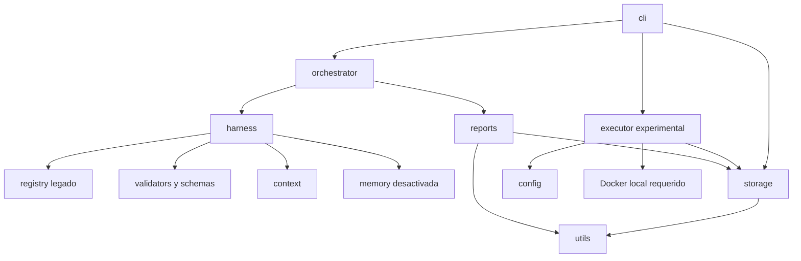

# Arquitectura implementada — NexoNova Factory 0.1.0 experimental

Fecha inicial: 2026-09-06. Actualización P2: 2026-09-09. Alcance: P0/P1 y P2 validado técnicamente con limitaciones, pendiente de revisión humana. Este documento describe código existente; no presenta TARGET_ARCHITECTURE como implementación terminada.

## Límites

La fábrica es un paquete Python local sin dependencias runtime externas. Los productos web todavía no se generan. Se preserva la separación conceptual entre fábrica y producto, y se exige una raíz de trabajo fuera del checkout para nuevos estados.

Los agentes académicos siguen presentes para mantener referencias y permitir revisión, pero registry los marca legacy y HarnessRunner bloquea su ejecución. No hay llamadas a modelos, prompts activos, memoria automática ni despliegue.

## Flujo de diagnóstico legado

CLI → OrchestratorGraph → HarnessRunner → rechazo explícito del agente legado → reports.finalize_run.

El cierre contiene estado real, trazabilidad de ciclos ejecutados, resultado, decisiones pendientes y manifiesto de hashes. CLI devuelve un código no cero. verify_run es lectura y verifica formato, identidad, hashes, outcomes y registros esperados. No convierte reportes históricos en pruebas válidas ni protege frente a un atacante que reescriba todo el almacén.

## Flujo experimental de herramientas

CLI → ProjectStore + FactoryConfig → ToolExecutor → aprobación host vinculada → snapshot filtrado → Docker local → resultado y estado de ejecución.

Solo existe python.unittest. No hay shell libre, pull automático ni proveedor externo. La falta de Docker/imagen produce un bloqueo verificable. El adaptador se validó con contenedores reales y datos sintéticos; la aprobación humana para uso con proyectos de clientes sigue pendiente.

El snapshot excluye metadata Git y cachés; rechaza archivos de credenciales conocidos, entradas binarias y contenido con señales de secretos. Se comprueba que su hash coincida con el contenido aprobado. Docker recibe ese snapshot de solo lectura, no el workspace original ni aprobaciones/estado. La detección de secretos es heurística y no sustituye una revisión de datos de entrada.

## Grafo de módulos



Ningún componente fue movido para ajustar visualmente el árbol. reports se extrajo porque comparte el contrato de cierre con CLI. storage centraliza las raíces y aprobaciones; utils concentra escritura atómica. config y executor no dependen de los agentes académicos.

## Contratos actuales

- WorkOrder/CycleState/AgentResult legados: interfaces conservadas, con comprobaciones de números finitos, presupuestos no negativos e IDs usados en rutas. No constituyen una implementación completa de JSON Schema.
- nexonova.run.v1: cierre de diagnóstico y manifiesto de artefactos. No implica aplicación lista.
- nexonova.tool-run.v1 / nexonova.tool-result.v1: lifecycle y resultados del adaptador. `complete` describe un proceso terminado con tests reportados, no certificación de calidad del producto ni aprobación humana. `executed=null` puede indicar incertidumbre tras timeout del cliente de contenedor.
- Aprobación host: acción, cliente/proyecto, hash de fuentes y política de ejecución, actor, caducidad y consumo único. El almacén confía en el operador Unix, no autentica identidades por un servicio externo.

## Almacenamiento

```text
<root privado>/<client-id>/<project-id>/
├── workspace/                 fuentes del futuro proyecto
├── temporary/                 snapshots efímeros propios de cada operación
├── runs/RUN-<uuid>/            estado y ToolResult
├── approvals/                 consentimiento del operador; fuera del contenedor
└── .writer.lock               exclusión de escritor mediante flock
```

Los IDs son slugs acotados. Se rechazan rutas no canónicas, escapes, enlaces y archivos especiales. Escrituras atómicas reemplazan el archivo completo con fsync; un lock cooperativo limita a un escritor. P2 incorpora checkpoints con salida parcial redactada y recuperación explícita de cierre sin repetir herramientas. El importador de referencias versionadas conserva nombres relativos y hashes del legado, sin copiar contenido ni validar sus claims. No hay reanudación automática ni política de retención. WorkOrders de test pueden restringir alcance, entradas, dry-run y latencia sin ampliar permisos globales; su contenido queda vinculado a la aprobación. Un actor host con la misma cuenta y escritura en toda la raíz puede vulnerar estas fronteras; ese escenario no queda resuelto por comprobaciones de Path.

Los snapshots de contexto requieren un directorio de ciclo nuevo. Hashes corresponden al contenido consumido. Fuentes pueden suministrarse explícitamente; la lista académica predeterminada se conserva para compatibilidad sin inventar sus siete archivos faltantes.

## Estado de seguridad y evolución

Pruebas Docker de aislamiento, recursos y limpieza ejecutadas; véase [la validación P2](migration/P2_FINAL_VALIDATION.md). Revisión humana pendiente de imágenes, operación tras crash, información sensible y modelo de permisos. Los tests de comandos, control de salida y rutas no acreditan aislamiento del kernel. Consulte [security.md](security.md) y [migration/P2.md](migration/P2.md).

P3 está detenido hasta recibir el brief concreto y cerrar P2. No existen templates, módulos web, actualización de productos, agentes con IA, CI de producto ni recetas de despliegue. La evolución propuesta permanece en [TARGET_ARCHITECTURE.md](../TARGET_ARCHITECTURE.md) y [MIGRATION_PLAN.md](../MIGRATION_PLAN.md).
